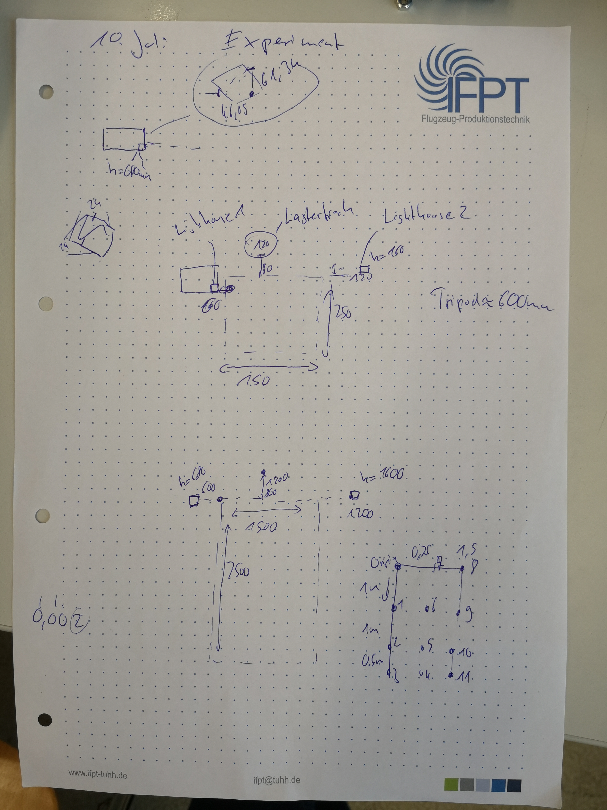
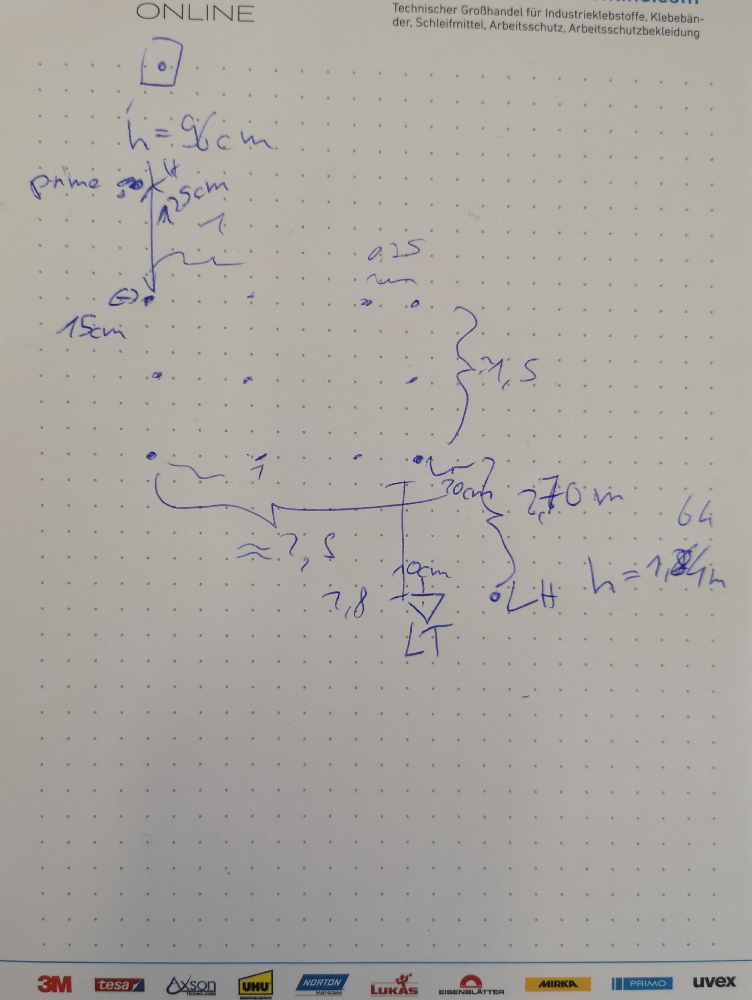

# Data obtained from measurements

This folder contains several subfolders which each contain data from one test set. This includes data from teh vie and the laser tracker as well as a YAML regarding the setup (position of lighthouses and laser tracker in regards to the measurement workspace). These workspace measurements are very rough if nothing else has been noted down. All data is raw data extracted from the software. Not Alteration or Processing has been done. Further down each testSet will be explained

## General Settings

The data from the Vive is extracted via [triadOpenVR wrapper](https://github.com/TriadSemi/triad_openvr). On a Windows 10 64bit system. For each position the vive tracker is kept stationary and 1000 measurement points are taken at a freq = 120Hz
The data from the Laser tracker is extracted via software and tranfered to Laptop as .txt or .csv.
The laser tracker is used with TBR 0.5 inch laser reflectors

## Data Naming Scheme

Every test sets is named via the day it was done. Furthermore a "_EXPx" is appended x=1,2,...n. Representing the number of experiment conducted on that day. A testset is considered an experiment if it was done in "one sitting". This is as to prevent change in teh test setup as well as caused by the fact that the Vive Lighthouse system recalibrates itself when either sight of trackers is regained or the system is restarted. This is meant that attention was paid to avoiding that the lighthouse lose sight of the tracker (e.g. not walkign in front)

The data is named regarding its use. RegistrationPoint are refereding to points used for inital registration of the laser reflectors with the connector. Typically there is just one per test set. 
Measurement points are different points within the workspace
laserdata is a list of all measured reflector positions. As the reflector is moved and no annotation is possibel within the program. Exact description of the steps are important.

## Testsets

Every test sets is listed. Any pecularties are explained. Its suitablitliy for further processing is also evaluated.

## 2020.07.10

Tests was conducted using a tripod to hold the tracker and laser reflector and moved within a 1.5x2.50m space. The measurement points mentioned in the data set are marked within the sketch as points the random point are "randomly" located within the space. The origin is marked as dot on the sketch. The tripod measurement procedure was used with the difference that per measurement position only one laser target (the one at the origin position on the connector plate) was measured in. 
Thus the problem in this set was that the tripod was moved by hand thus introducing rotation. As only single point measurements were taken no information can be gained regarding the vive positional accuracy without using the vive rotational information. Therefore the position accuracy would become corrupted by the rotation accuracy.

The controller was placed in the middle to prevent recalibrating.

## 2020.07.17

Two test were conducted with the same setup and procedure. The split was caused to the fact that the Vive Tracker run out of charge and had to be charged. The robot position measurement procedure was used.

## 2020.08.20

This experiemtn does not contain laser data as the laser tracker was not available. Instead the vive tracker was placed on a table this table was moved within the workspace.

## 2020.08.27

Standard procedure

## 2020.09.17

Experiment 90° orientation of the LHs to one another
Initally measured the Lighthouse position from the center of the field of observation (LH-main. LH-aux). 
3 Levels with 9 points per level
Afterwards collected 8 random points
Experiment 1 is the 3x9 points
Experiment 2 is the 3x9 points + 8 random points.

## 2020.09.18

Exp1 is one plane measuremnts 
Exp2
at measurement point 18 or rather point 1 level 3 the laser tracker data istn available
hence deleted
This is also the case for Exp3 which is the extended one to Exp2 

## 2020.10.01

Exp 1 and Exp 2 doen wiht 180° 
All measurements worked. 
Problem rotation of the coordiante system
Exp 2 is Exp plus added random points

## 2020.10.02
Exp1
20min Drift
Setup 
Vive on a tripod, roughly level to the ground. LH are placed 180°, at roughly . Vive bottom is at roughly 600mm, LH Center at roughly 130 above ground=> See the LH_180° 

Procedure
5Hz 60*20*5 measurements 
Results:
Take last 10 sec and first 10 sec

Exp2
Drei Experimente
Recalibration Experiment
Setup
Vive on a tripod, roughly level to the ground. LH are placed 180°, at roughly . Vive bottom is at roughly 600mm, LH Center at roughly 130 above ground=> See the LH_180° 
A controller remains in view

Procedure
Position tracker for 100 measurements thenput carton over him for 25seconds. Then let tracking regain and measure

Setup
Same as before but instead there is no controller in the view

Procedure
Same

Setup 
Same
Procedure
Same as before but instead of putting carton above tracker. SteamVr is shutdown and restarted

Exp3
